<h1> PennyWarden</h1>

**A free, self-hosted financial ledger for small organizations** — clubs, booster groups, associations, parent
organizations and similar bodies that keep a checkbook, a budget and an annual audit. PennyWarden runs on your own
Windows PC, Mac or Linux server; your data stays in one folder you control. No subscription, no cloud account.

Current release: **1.7.1** (called *Fundwarden* from 1.6.6 to 1.6.8) · [Download](https://github.com/kretherford0983/PennyWarden/releases/latest) ·
[Install](#install) · [Documentation](#documentation) · [Changelog](CHANGELOG.md)

<p align="center">
  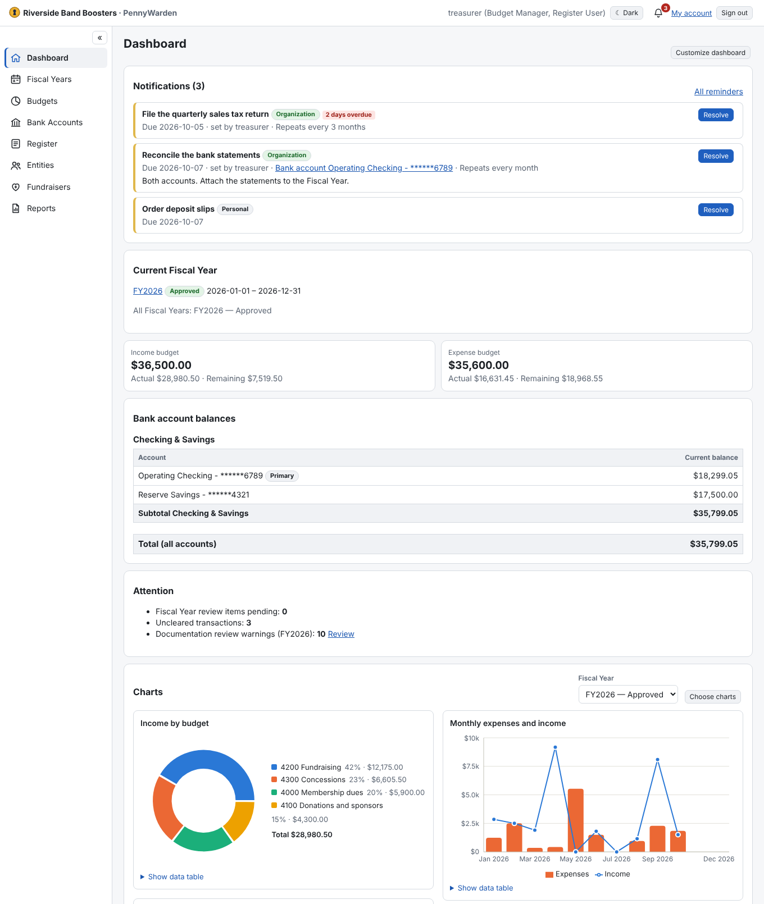
</p>

<sub>All screenshots show a made-up organization (`scripts/demo_data.py`).</sub>

## Why PennyWarden

A volunteer treasurer has to answer three questions at any time: *what did we plan, what actually happened, and
can we prove it?* PennyWarden is built around those three — **budgets**, **bank registers** and **documentation
that an auditor can follow** — and around the fact that treasurers change: everything a successor or an audit
committee needs is in the application, not in someone's spreadsheet.

## Core features

### Budgets by Fiscal Year

Plan income and expenses per Fiscal Year, with sub-budgets where you need detail. Every budget shows the plan,
the actual amounts per quarter and what remains. Budgets are approved and locked together with the Fiscal Year; changing
one afterwards means unlocking it with a stated reason, which is recorded.

<p align="center">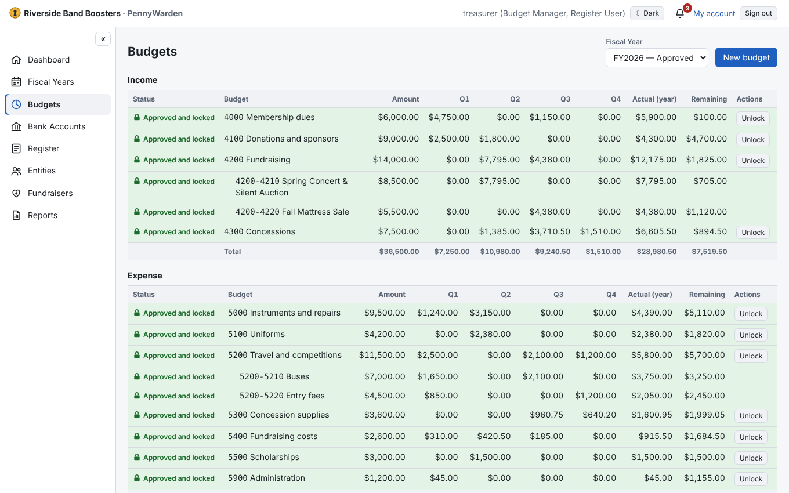</p>

### Bank registers

One continuous register per checking, savings or investment account. A transaction can be split across several
budgets, transfers between accounts are entered once, and cleared dates give a running balance you can compare
with the bank statement. Duplicate transactions and check numbers are caught, missing check numbers are listed for
review, and a mistake is voided — never silently deleted.

<p align="center">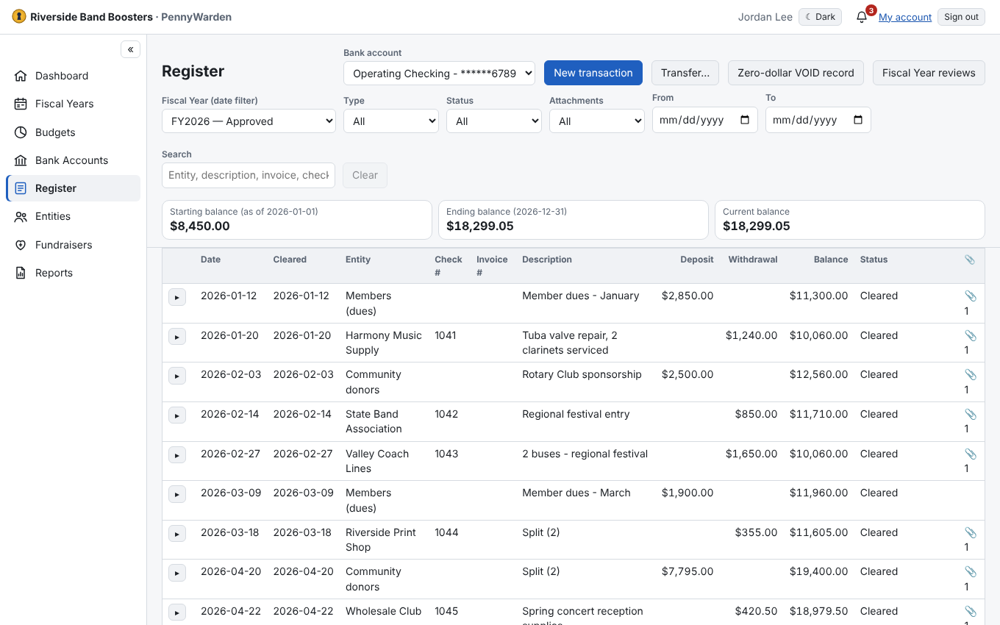</p>

### Audit-ready reports

Attach the invoice, receipt or deposit slip (PDF, PNG, JPEG) to each transaction. The **End of Year Audit Report**
is one printable PDF: the budgets, then every transaction followed directly by its own attachments, an optional
signature page, and — when it covers several bank accounts — a start and an end page per account with page counts,
so a reviewer can see that nothing is missing. A documentation review shows what still lacks a document before
anyone asks.

<p align="center">
  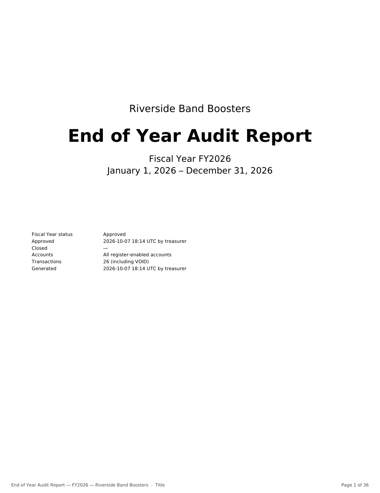
  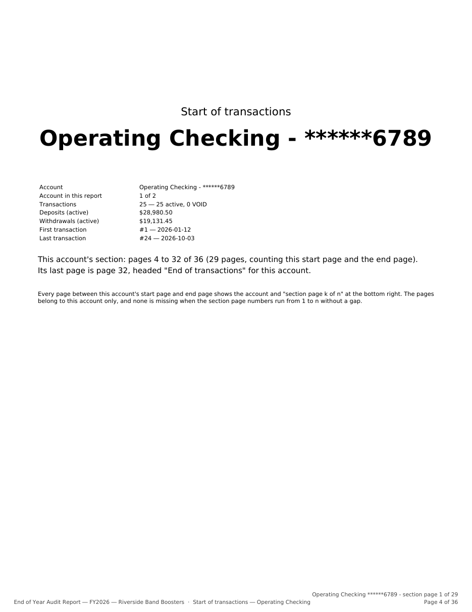
  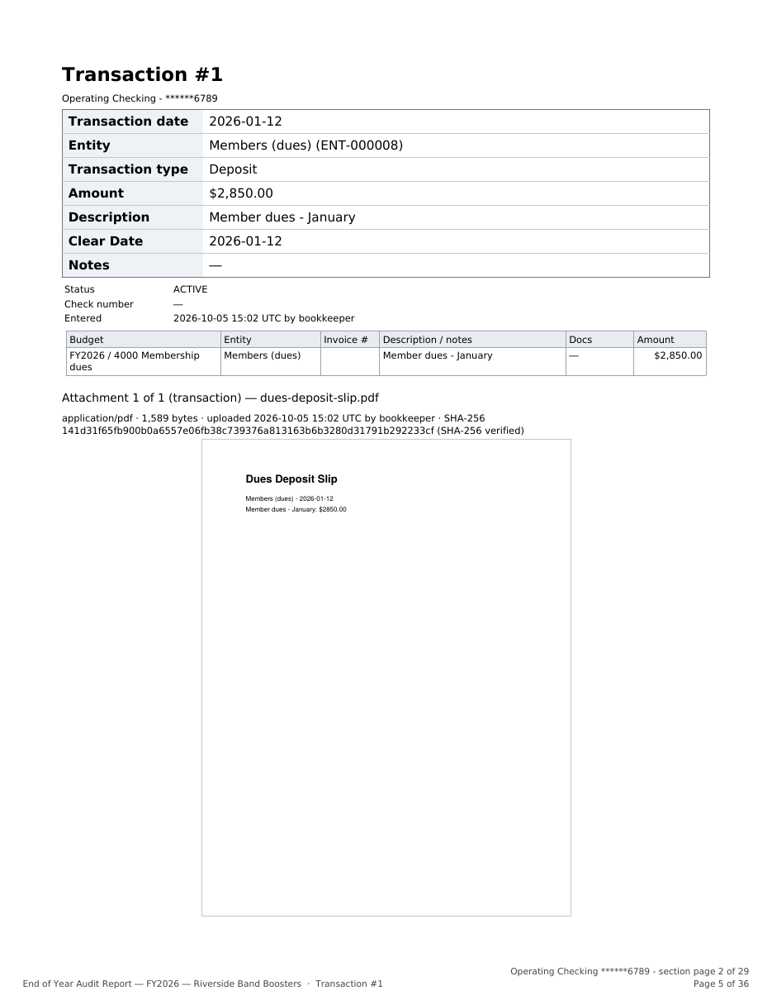
</p>

### Closing the year

A Fiscal Year is approved, worked in and closed. Closing checks that everything has cleared, that the audit
signoff is on file and that open review items are resolved, and stores a **Close report** with the year's
documents. A closed year can no longer be changed.

<p align="center">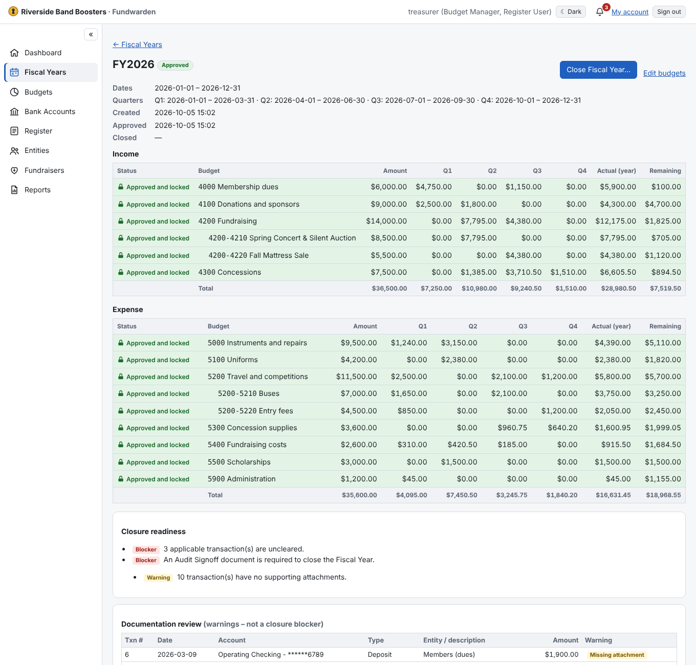</p>

### Fundraisers <sub>(optional module)</sub>

Follow an event from the first poster to the last deposit: which budgets it uses, income and expenses, the net
result, a breakdown by offering (tickets, auction, food…), the cash float, a fundraiser report — and a printable
**cash count sheet** for the people counting the cash box.

<p align="center">
  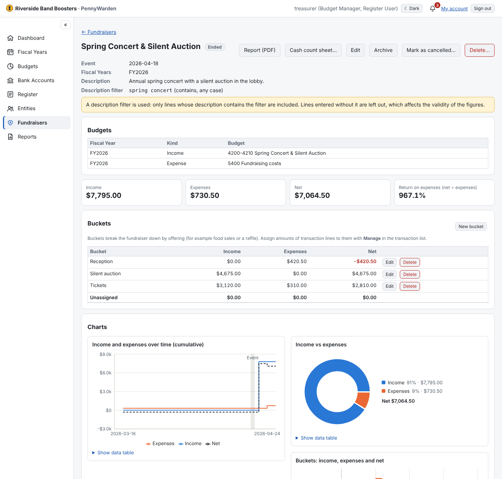
  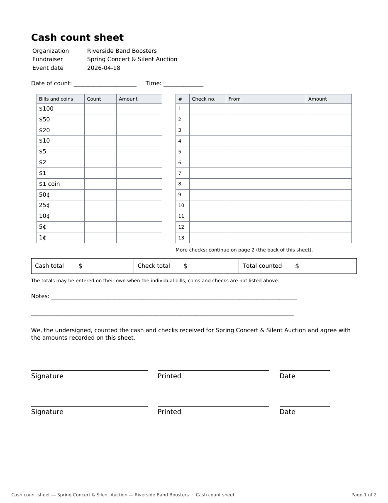
</p>

### Reminders

Personal reminders and reminders for the whole organization, shown on the dashboard and behind the bell until
someone resolves them. Organization reminders can **repeat** — reconcile the statements every month, file the
return every quarter, renew the insurance every year — so duties survive a change of treasurer.

<p align="center">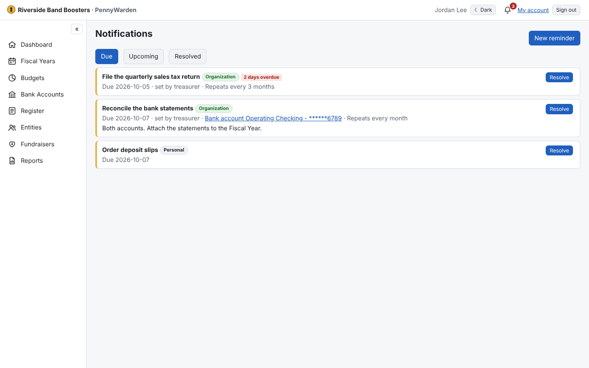</p>

## Everything it does

| | |
|---|---|
| **Fiscal Years and budgets** | Hierarchical income and expense budgets, quarterly actuals, approval and lock, unlock with a reason, Fiscal Year close with a stored Close report |
| **Registers** | Checking, savings and investment accounts; split allocations; transfers; cleared dates; void lifecycle; duplicate and check-number protection; missing-check review |
| **Documentation** | Attachments on transactions and on single allocations; typed Fiscal Year documents (approval, audit signoff); documentation review; "no attachment" with a stated reason |
| **Reports** | End of Year Audit PDF with signature page and account start/end pages; Fiscal Year Close report; Entity activity report with CSV export; fundraiser report; cash count sheet |
| **Dashboard** | Bank balances, budget progress, items needing attention, charts; each user chooses and arranges their own sections; light and dark mode |
| **Fundraisers** | Budgets, offerings ("buckets"), cash float, exclusions, documents, cancelled events, events spanning two Fiscal Years |
| **Reminders** | Personal and organization reminders, show-before days, links to a Fiscal Year, budget or account, repeating organization reminders |
| **People and vendors** | Entities for organizations and individuals, a person's position (offered as the title when they sign) |
| **Roles** | Administrator, Budget Manager, Budget User, Register User and read-only Auditor; administration is kept strictly apart from financial work |
| **Security** | Argon2id passwords, two-step verification (TOTP) with recovery codes, server-side sessions, CSRF protection, AES-256-GCM encrypted bank account numbers, an append-only audit log of every change |
| **Your data** | One folder on your machine; encrypted backup and restore from inside the application; moves between Windows, Mac and Linux; upgrades never touch data or configuration |
| **Where it runs** | Single user on a Windows PC or a Mac (Apple Silicon); several users on a Linux server behind HTTPS, or in Docker |

<p align="center">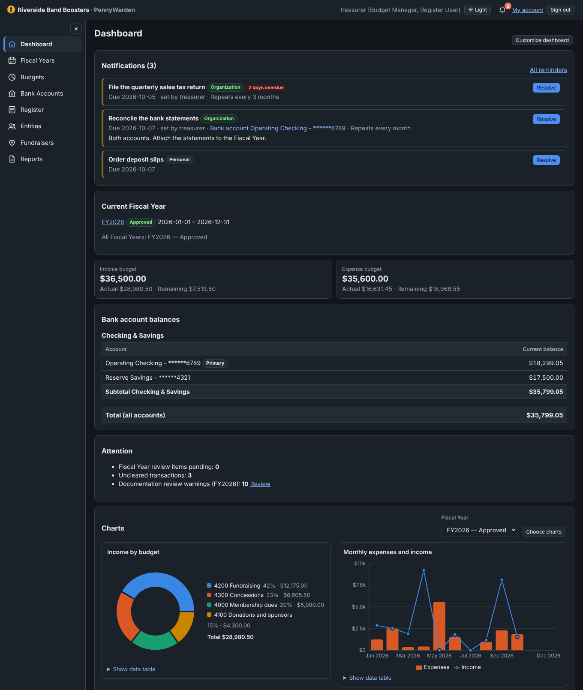</p>

## Install

| | |
|---|---|
| **Mac with Apple Silicon (single user)** | Download `PennyWarden-<version>-macos-arm64.dmg` from the [latest release](https://github.com/kretherford0983/PennyWarden/releases/latest), drag PennyWarden to Applications and open it. First start: *System Settings → Privacy & Security → Open Anyway* ([details](docs/deployment.md)). |
| **Windows (single user)** | Download `PennyWarden-<version>-windows-x64.exe` from the [latest release](https://github.com/kretherford0983/PennyWarden/releases/latest) and double-click it. |
| **Linux server (multiple users)** | `curl -fsSL https://github.com/kretherford0983/PennyWarden/releases/latest/download/install.sh \| sudo bash` — installs or upgrades a systemd service; put an HTTPS reverse proxy in front of it. |

The first start shows the **Initialization Wizard** (organization name, administrator account). There are no
default credentials. Details, HTTPS, Docker and moving data between machines: [docs/deployment.md](docs/deployment.md).
Upgrades never touch your data or configuration: [docs/upgrade.md](docs/upgrade.md). **Make encrypted backups
regularly** (System/About → Backup / Restore) and keep them off the machine: [docs/backup-restore.md](docs/backup-restore.md).

PennyWarden is provided without warranty (see [License](#license)). It is a record-keeping tool, not accounting,
tax or legal advice.

## Documentation

**Using PennyWarden** — the guides describe what each release line added; read them in order for the full picture:
[1.2](docs/user-guide-v1.2.md) (reports, transfers) · [1.3](docs/user-guide-v1.3.md) (Fiscal Year documents, close
report) · [1.4](docs/user-guide-v1.4.md) (audit signatures, two-step verification, charts, backup) ·
[1.5](docs/user-guide-v1.5.md) (dashboard layout, installers) · [1.6](docs/user-guide-v1.6.md) (fundraisers,
reminders) · [1.7](docs/user-guide-v1.7.md) (the new name).

**Running PennyWarden**
- [docs/deployment.md](docs/deployment.md) — local and server installation, HTTPS reverse proxy, Docker, data portability
- [docs/upgrade.md](docs/upgrade.md) — upgrading and rolling back; database changes per version
- [docs/backup-restore.md](docs/backup-restore.md) — encrypted backups, restore, disaster recovery
- [docs/configuration.md](docs/configuration.md) — settings, config file, environment variables, data layout
- [docs/security.md](docs/security.md) — security controls and dependency-vulnerability checks

**Developing PennyWarden**
- [docs/branching.md](docs/branching.md) — branches, builds, releases and versioning (`Breaking.Major.Minor`)
- [docs/implementation-notes.md](docs/implementation-notes.md) — design decisions, including every change request (§1a)
- [CHANGELOG.md](CHANGELOG.md) — what changed in each version
- `scripts/demo_data.py` and `scripts/readme_screenshots.mjs` — fill a new, empty installation with a made-up
  organization and retake the screenshots on this page

**Origin.** PennyWarden started as an implementation of the *Financial Management POC Agent-Agnostic Benchmark v1.1*.
The specification is kept unchanged in [`spec/`](spec/); [docs/acceptance-results.md](docs/acceptance-results.md),
[docs/benchmark-results.md](docs/benchmark-results.md) and [docs/manual-verification.md](docs/manual-verification.md)
record the results against that specification as of version 1.1 and are not updated for later versions. Until 1.6.5
the application was called *Financial Management POC* / *Freedger*, from 1.6.6 to 1.6.8 *Fundwarden*, and since
1.7.0 *PennyWarden*; the Python package (`fmpoc`), the database file and the `FM_*` settings keep the first internal
names. Upgrading an installation from before a rename: [docs/upgrade.md](docs/upgrade.md).

## Technology

| | |
|---|---|
| Frontend | React 18 + TypeScript (Vite build, served by FastAPI) |
| Backend | Python 3.11/3.12, FastAPI, SQLAlchemy 2, Alembic, SQLite |
| Tests | 230+ backend API tests (incl. security negative tests) and 31 Playwright E2E UI tests, run on every pull request; every package is smoke-tested before it is published |

## Build from source

```bash
python3 -m venv .venv && . .venv/bin/activate          # Windows: .venv\Scripts\activate
pip install -r backend/requirements-dev.txt
npm --prefix frontend ci && npm --prefix frontend run build   # emits backend/fmpoc/static
cd backend && python -m fmpoc                          # local mode: http://127.0.0.1:8765, opens browser
```

Useful options: `--mode server --host 0.0.0.0 --port 8765 --data-dir DIR --no-browser` (see
[docs/configuration.md](docs/configuration.md)). Frontend development with hot reload: run the backend
(`python -m fmpoc --no-browser`) and `npm --prefix frontend run dev` (Vite proxies `/api` to port 8765).

### Tests

```bash
cd backend && python -m pytest                    # API tests incl. security negative tests
cd frontend && npx tsc --noEmit -p . && npm run build
cd frontend && FM_PYTHON=$(which python) npx playwright test                     # E2E vs source
cd frontend && FM_BUNDLE=../dist/pennywarden/pennywarden npx playwright test   # E2E vs package
bash scripts/security_check.sh                    # pip-audit + npm audit + security tests
```

### Packaging

| Artifact | Command | Notes |
|---|---|---|
| Linux x86-64 portable (servers, glibc ≥ 2.27) | `bash packaging/build_linux_portable.sh` | → `dist/PennyWarden-linux-x64-portable.tar.gz`; install with `sudo bash packaging/linux/install-server.sh <tarball>` |
| Linux x86-64 self-contained | `bash packaging/build_linux.sh` | PyInstaller onedir → `dist/PennyWarden-linux-x64.tar.gz` |
| Windows x86-64 portable folder | `bash packaging/build_windows_portable.sh` | Runs on any OS; relocatable CPython + win_amd64 wheels → `dist/PennyWarden-windows-x64.zip`; launch `PennyWarden.cmd` |
| Windows x86-64 one-file .exe | `pyinstaller --noconfirm --distpath dist packaging/pyinstaller/fmpoc-onefile.spec` | Build on Windows (CI: `windows-latest`) → `PennyWarden-<version>-windows-x64.exe` |
| macOS arm64 app + disk image | `bash packaging/build_macos.sh` | Build on a Mac with Apple Silicon (CI: `macos-15`) → `dist/PennyWarden.app`, `PennyWarden-<version>-macos-arm64.dmg` (ad hoc signed) |
| Windows x86-64 PyInstaller folder | `pwsh packaging/build_windows.ps1` | Build on Windows → `PennyWarden.exe` |
| Linux one-command install | `packaging/linux/install.sh` | Published with every release — see [docs/deployment.md](docs/deployment.md) |
| Docker (optional, server) | `docker build -f packaging/docker/Dockerfile -t pennywarden .` | plus `docker-compose.yml` with Caddy HTTPS |
| Docker from bundle (no registry needed) | `bash packaging/docker/build_bundle_image.sh` | image from the self-contained Linux bundle |

CI/CD (GitHub Actions, `.github/workflows/`): every pull request and feature branch runs the full test suite; merges
into `develop`, `test` and `main` build the packages; `test` publishes a pre-release `v<version>-test.<n>` and `main`
publishes the production release `v<version>`. See [docs/branching.md](docs/branching.md).

### Repository layout

```
backend/fmpoc/            FastAPI app (routers/, services/, security/, migrations/, static/ = built UI)
backend/tests/            pytest suite
frontend/src/             React + TypeScript UI;  frontend/e2e/  Playwright tests
packaging/                PyInstaller specs, Linux/Windows build scripts, installers, Docker
scripts/                  version, promotion and release checks, security_check.sh
spec/                     original benchmark specification (unchanged)
docs/                     user guides, operations and implementation documentation
```

## Issues and contributions

Bugs and enhancement requests: [GitHub issues](https://github.com/kretherford0983/PennyWarden/issues). Please do **not**
put real financial data, account numbers or backups in an issue.

## License

PennyWarden is free software: you can redistribute it and/or modify it under the terms of the
[GNU Affero General Public License v3.0](LICENSE) (AGPL-3.0-only). If you run a modified version for other people
over a network, you must offer them its source code. Bundled third-party components keep their own licenses — see
[THIRD-PARTY-NOTICES.txt](THIRD-PARTY-NOTICES.txt) (regenerate with `python scripts/third_party_notices.py`; CI
checks it is current).
