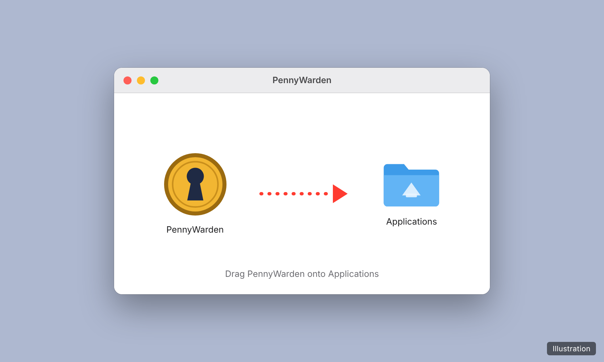
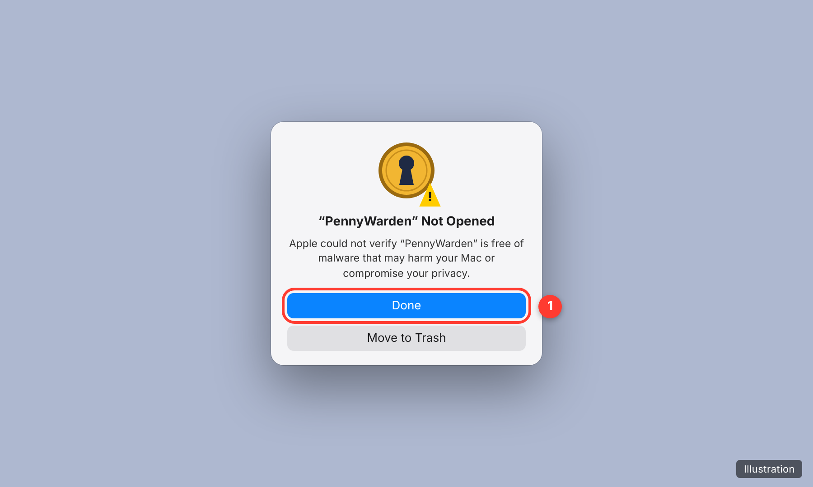
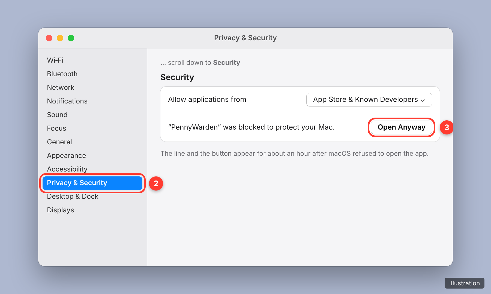
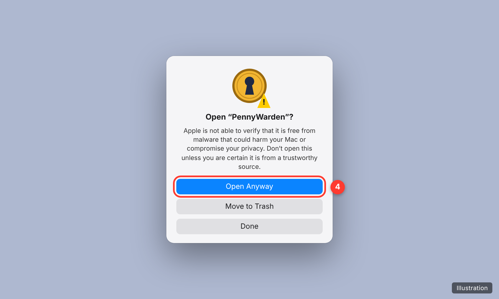
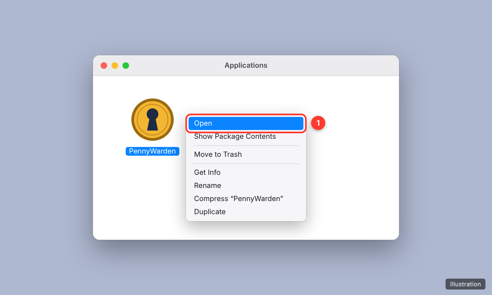

# Installing PennyWarden on a Mac

For a Mac with Apple Silicon (M1 or later) and macOS 11 or later. PennyWarden does not run on Intel Macs.

macOS checks every app downloaded from the internet. PennyWarden is not signed with an Apple Developer ID and
not notarized by Apple, so the **first time** you open it macOS refuses and you need to allow it once in System
Settings. This page shows each step.

> The pictures on this page are **illustrations**, not screenshots: they show where to click. The wording follows
> macOS 15 (Sequoia); on other versions it can be slightly different.

## 1. Download

From the [latest release](https://github.com/kretherford0983/PennyWarden/releases/latest), under *Assets*,
download **`PennyWarden-<version>-macos-arm64.dmg`**.

*Optional — check the download:* also download `SHA256SUMS.txt` from the same release, then in Terminal:

```bash
cd ~/Downloads
shasum -a 256 PennyWarden-*-macos-arm64.dmg
```

The long code it prints must match the line for the `.dmg` in `SHA256SUMS.txt`.

## 2. Copy PennyWarden to Applications

Double-click the downloaded `.dmg`. A window opens: drag **PennyWarden** onto **Applications**. Then close the
window and eject the disk image (the *PennyWarden* drive in the Finder sidebar).

<p align="center"></p>

## 3. Open PennyWarden — macOS refuses the first time

Open **Applications** and double-click **PennyWarden**. macOS shows *"PennyWarden" Not Opened*. This is expected.
Click **Done** (①). Do **not** click *Move to Trash*.

<p align="center"></p>

## 4. Allow it in System Settings

Open the **Apple menu → System Settings**, click **Privacy & Security** in the sidebar (②) and scroll down to
**Security**. Next to *"PennyWarden" was blocked to protect your Mac.* click **Open Anyway** (③).

<p align="center"></p>

The line appears only for about an hour after step 3. If it is not there, open PennyWarden again (step 3), then come
back here.

## 5. Confirm

macOS asks once more. Click **Open Anyway** (④) and enter your Mac password or use Touch ID when asked.

<p align="center"></p>

PennyWarden starts. A small PennyWarden window shows the address and has **Open PennyWarden** and **Quit**; your
browser opens PennyWarden by itself. On the very first start you see the setup wizard, which creates your
organization and the first Administrator.

From now on PennyWarden opens with a double-click like any other app. Closing the small window (or **Quit**) stops
PennyWarden.

## macOS 14 (Sonoma) and earlier: a shorter way

On these versions you can also skip steps 3 to 5: in **Applications**, **right-click** (or Control-click)
**PennyWarden** and choose **Open** (①), then click **Open** in the message that follows. The System Settings way
above works as well.

<p align="center"></p>

## When you upgrade

Quit PennyWarden, open the new `.dmg` and drag PennyWarden onto **Applications** again; choose **Replace**. Your
data is kept: it is stored in `~/Library/Application Support/PennyWarden`, never inside the app. macOS may treat the
new version as a new app and ask again — then repeat steps 3 to 5.

## If something is different

- **"PennyWarden is damaged and can't be opened"**: the download was probably incomplete or changed. Delete it,
  download it again and check it as in step 1. Do not use Terminal commands found online to remove the warning from
  a file whose checksum does not match.
- **No *Open Anyway* button:** open PennyWarden from **Applications** once more and go straight to System Settings —
  the button is shown only for a while after macOS refused to open the app.
- **Your Mac is managed by an organization** (school or company): it may not allow apps that are not notarized. Ask
  the people who manage it, or use the Linux server installation instead (docs/deployment.md).

More about the Mac app (server mode from Terminal, where the data is, backups): [docs/deployment.md](deployment.md).
